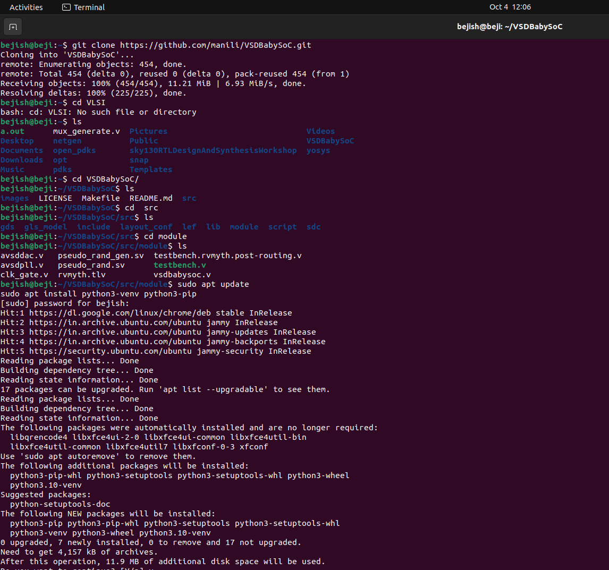
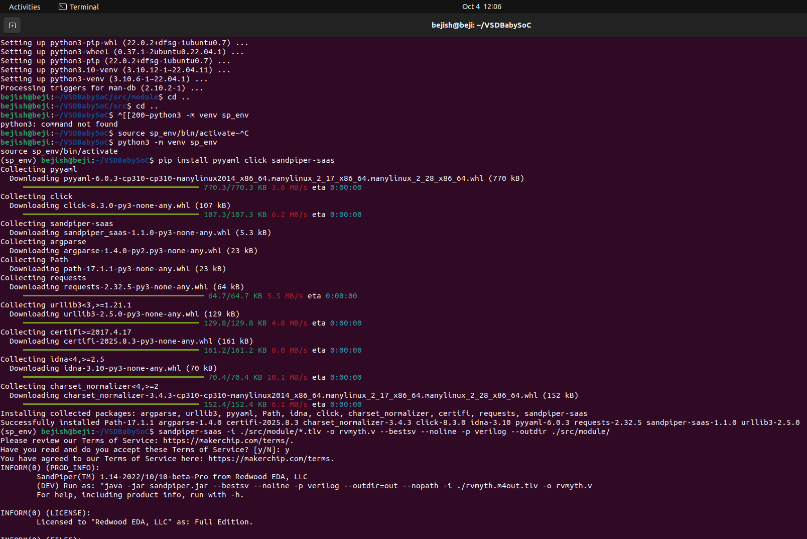
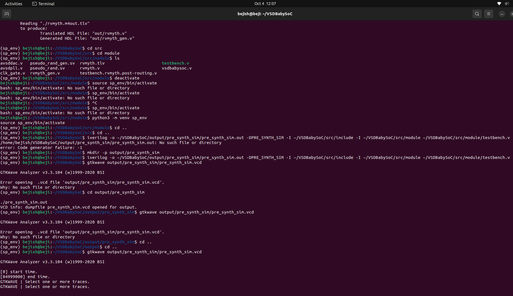
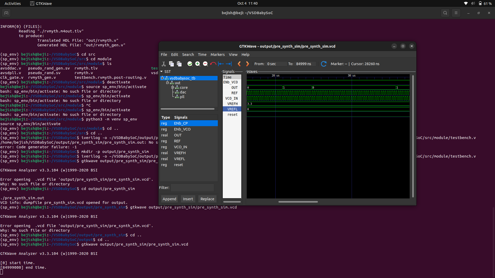
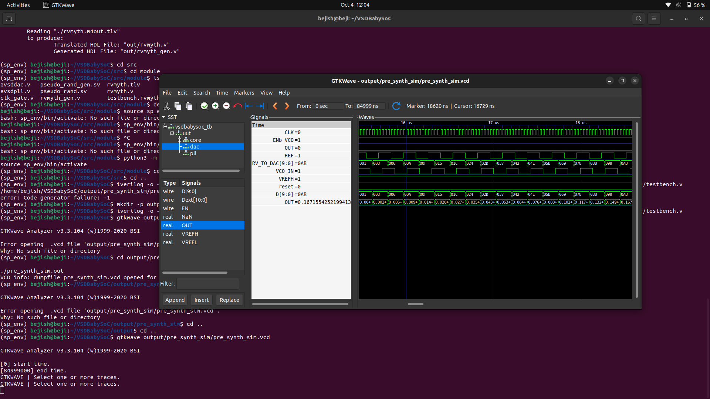
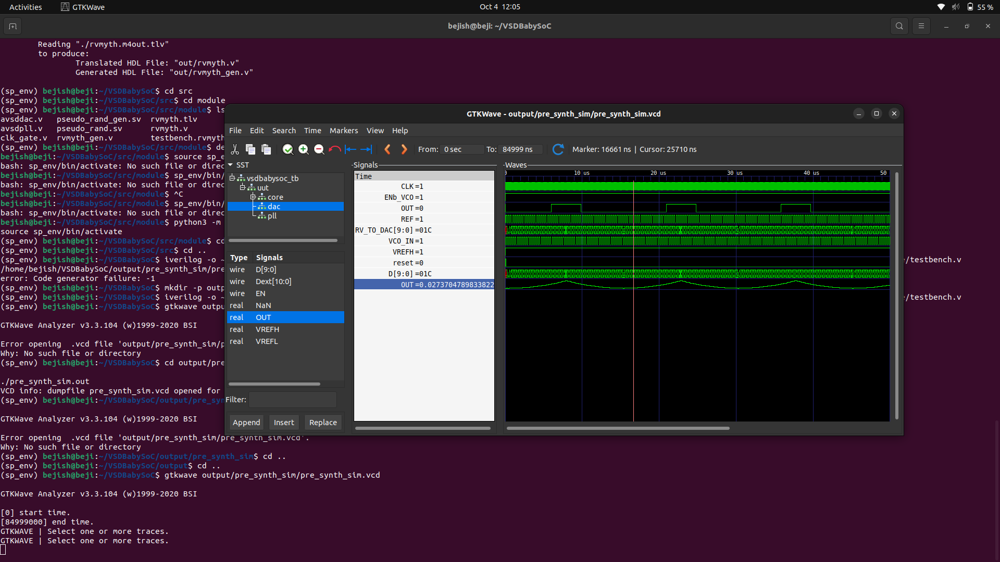
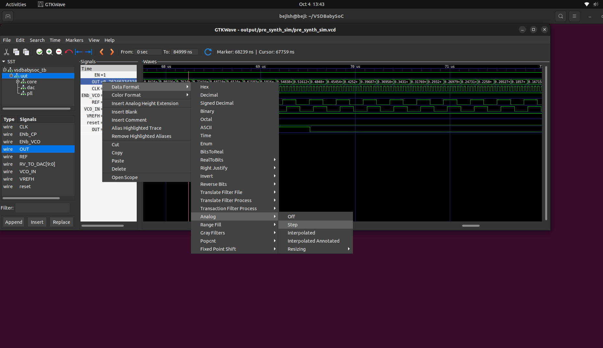

# 🚀 Week 2: BabySoC Fundamentals & Functional Modelling
### *From SoC Theory to Pre-Synthesis Simulation - A Complete Journey*

[](#)
[](#)
[](#)
[](#)
[](#)
[](#)

---

## 🎯 **Week 2 Objective**

Build a comprehensive understanding of System-on-Chip fundamentals and master functional modelling of VSDBabySoC using industry-standard simulation tools (Icarus Verilog & GTKWave).

---

🚀 Week 2: BabySoC Fundamentals & Functional Modelling
From SoC Theory to Pre-Synthesis Simulation - A Complete Journey
Show Image
Show Image
Show Image
Show Image
Show Image
Show Image

🎯 Week 2 Objective
Build a comprehensive understanding of System-on-Chip fundamentals and master functional modelling of VSDBabySoC using industry-standard simulation tools (Icarus Verilog & GTKWave).

📚 Part 1: Understanding System-on-Chip (SoC) Design
<div align="center">
What is a System-on-Chip (SoC)?
mermaidgraph TB
    A[Traditional Multi-Chip System] -->|Evolution| B[System-on-Chip SoC]
    
    A1[CPU Chip] --> A
    A2[Memory Chip] --> A
    A3[I/O Controller] --> A
    A4[GPU Chip] --> A
    A5[Power IC] --> A
    
    B --> C[Single Silicon Die]
    C --> D[Complete Integrated System]
    
    D --> E1[Superior Performance]
    D --> E2[Lower Power]
    D --> E3[Smaller Size]
    D --> E4[Reduced Cost]
    
    style A fill:#ffcccc,stroke:#ff0000,stroke-width:2px
    style B fill:#ccffcc,stroke:#00ff00,stroke-width:3px
    style D fill:#cce5ff,stroke:#0066cc,stroke-width:2px
    style E1 fill:#ffffcc,stroke:#ffcc00
    style E2 fill:#ffffcc,stroke:#ffcc00
    style E3 fill:#ffffcc,stroke:#ffcc00
    style E4 fill:#ffffcc,stroke:#ffcc00
Core Philosophy: Integration leads to efficiency. By consolidating disparate components onto a single semiconductor die, we achieve superior performance, reduced power consumption, and minimal form factor - the foundation of modern mobile and embedded systems.
</div>

SoC Architecture: Complete System Overview
<div align="center">
```mermaid
graph TB
    subgraph SoC["🔷 System-on-Chip (SoC)"]
        CPU[💻 CPU<br/>Digital Brain]
        MEM[💾 Memory<br/>Storage Hierarchy]
        GPU[🎮 GPU<br/>Visual Engine]
        DSP[📡 DSP<br/>Signal Processing]
    PMU[⚡ PMU<br/>Power Management]
    IO[🔌 I/O Interfaces<br/>External Communication]
    INTERCONNECT[🔀 Interconnect Fabric<br/>High-Speed Buses]
    IP[🧩 Specialized IPs<br/>Custom Accelerators]
    
    CPU <--> INTERCONNECT
    MEM <--> INTERCONNECT
    GPU <--> INTERCONNECT
    DSP <--> INTERCONNECT
    IO <--> INTERCONNECT
    IP <--> INTERCONNECT
    
    PMU -.->|Power Distribution| CPU
    PMU -.->|Power Distribution| MEM
    PMU -.->|Power Distribution| GPU
    PMU -.->|Power Distribution| DSP
    PMU -.->|Power Distribution| IO
end

EXT1[📱 External Devices] <--> IO
EXT2[🎥 Cameras] <--> IO
EXT3[🔊 Audio] <--> IO
EXT4[📡 Wireless] <--> IO

style SoC fill:#e6f3ff,stroke:#0066cc,stroke-width:3px
style CPU fill:#ffcccc,stroke:#cc0000,stroke-width:2px
style MEM fill:#ccffcc,stroke:#00cc00,stroke-width:2px
style GPU fill:#ffccff,stroke:#cc00cc,stroke-width:2px
style DSP fill:#ffffcc,stroke:#cccc00,stroke-width:2px
style PMU fill:#ffcc99,stroke:#ff6600,stroke-width:2px
style INTERCONNECT fill:#99ccff,stroke:#0066ff,stroke-width:2px

</div>

---

### **Core Components Deep Dive**

<div align="center">
```mermaid
mindmap
  root((SoC<br/>Components))
    CPU
      Instruction Execution
      Multi-core Processing
      Application Logic
      Decision Making
    Memory
      RAM Volatile
      ROM/Flash Non-volatile
      Cache L1/L2/L3
      Memory Controller
    GPU
      Graphics Rendering
      Parallel Processing
      Video Encoding
      GPGPU Computing
    DSP
      Signal Processing
      Audio Enhancement
      Video Codecs
      Communications
    I/O
      USB Controllers
      Display Interfaces
      Camera Interfaces
      Protocol Engines
    PMU
      Voltage Regulation
      Power Scaling
      Sleep States
      Battery Management
    Interconnect
      AXI Bus
      AHB Bus
      APB Bus
      NoC Network
    IP Blocks
      Wi-Fi/Bluetooth
      Security Engines
      Hardware Accelerators
      Sensor Interfaces
</div>

Component Interaction Flow
<div align="center">
```mermaid
sequenceDiagram
    participant APP as Application
    participant CPU as CPU Core
    participant MEM as Memory
    participant IC as Interconnect
    participant GPU as GPU
    participant IO as I/O Controller
    participant EXT as External Device
APP->>CPU: Execute Instruction
CPU->>IC: Request Data
IC->>MEM: Fetch Data
MEM-->>IC: Return Data
IC-->>CPU: Data Delivered

CPU->>IC: Graphics Command
IC->>GPU: Render Request
GPU->>GPU: Process Pixels
GPU-->>IC: Frame Ready
IC-->>IO: Display Data
IO->>EXT: Output Signal

Note over CPU,EXT: All transactions synchronized via Interconnect Fabric

</div>

---

### **Why SoCs Matter: The Integration Advantage**

<div align="center">
```mermaid
graph LR
    A[SoC Integration] --> B[Space Efficiency]
    A --> C[Energy Optimization]
    A --> D[Performance Enhancement]
    A --> E[Cost Reduction]
    A --> F[Reliability]
    
    B --> B1[📱 Miniaturization<br/>Smartphones to IoT]
    C --> C1[⚡ Lower Power<br/>10x-100x Improvement]
    D --> D1[🚀 Higher Speed<br/>Reduced Latency]
    E --> E1[💰 Single-Chip Manufacturing<br/>Simpler Assembly]
    F --> F1[🛡️ Fewer Connections<br/>Robust Design]
    
    style A fill:#0066cc,stroke:#003366,stroke-width:3px,color:#fff
    style B fill:#66cc66,stroke:#339933,stroke-width:2px
    style C fill:#ffcc66,stroke:#ff9933,stroke-width:2px
    style D fill:#cc66ff,stroke:#9933cc,stroke-width:2px
    style E fill:#ff6666,stroke:#cc3333,stroke-width:2px
    style F fill:#66ccff,stroke:#3399cc,stroke-width:2px
</div>

SoC vs Traditional Multi-Chip Comparison
<div align="center">
```mermaid
graph TB
    subgraph Traditional["❌ Traditional Multi-Chip System"]
        T1[CPU<br/>Chip 1]
        T2[Memory<br/>Chip 2]
        T3[GPU<br/>Chip 3]
        T4[I/O<br/>Chip 4]
        T5[Power<br/>Chip 5]
    T1 -.Long Wires.-> PCB1[PCB Traces]
    T2 -.Long Wires.-> PCB1
    T3 -.Long Wires.-> PCB1
    T4 -.Long Wires.-> PCB1
    T5 -.Power Lines.-> PCB1
    
    PCB1 --> TCON[❌ Disadvantages]
    TCON --> TC1[Large Size]
    TCON --> TC2[High Power]
    TCON --> TC3[Slow Speed]
    TCON --> TC4[Expensive]
end

subgraph SoCSystem["✅ System-on-Chip (SoC)"]
    S1[CPU]
    S2[Memory]
    S3[GPU]
    S4[I/O]
    S5[PMU]
    
    S1 <--> BUS{Interconnect<br/>Fabric}
    S2 <--> BUS
    S3 <--> BUS
    S4 <--> BUS
    S5 -.-> BUS
    
    BUS --> SCON[✅ Advantages]
    SCON --> SC1[Compact]
    SCON --> SC2[Efficient]
    SCON --> SC3[Fast]
    SCON --> SC4[Cost-Effective]
end

style Traditional fill:#ffe6e6,stroke:#cc0000,stroke-width:2px
style SoCSystem fill:#e6ffe6,stroke:#00cc00,stroke-width:3px
style TCON fill:#ffcccc,stroke:#ff0000
style SCON fill:#ccffcc,stroke:#00ff00

</div>

---

### **Real-World SoC Applications**

<div align="center">
```mermaid
graph TB
    SOC[System-on-Chip<br/>Technology]
    
    SOC --> APP1[📱 Smartphones]
    SOC --> APP2[⌚ Wearables]
    SOC --> APP3[🏠 IoT Devices]
    SOC --> APP4[🚗 Automotive]
    SOC --> APP5[💻 Tablets/Laptops]
    SOC --> APP6[🎮 Gaming Consoles]
    
    APP1 --> EX1[Apple A-Series<br/>Qualcomm Snapdragon]
    APP2 --> EX2[Smart Watch Chips<br/>Fitness Trackers]
    APP3 --> EX3[Smart Home Sensors<br/>Edge AI Devices]
    APP4 --> EX4[ADAS Systems<br/>Infotainment]
    APP5 --> EX5[Apple M-Series<br/>ARM-based Laptops]
    APP6 --> EX6[PlayStation/Xbox<br/>Nintendo Switch]
    
    style SOC fill:#0066cc,stroke:#003366,stroke-width:3px,color:#fff
    style APP1 fill:#ff99cc,stroke:#ff3399
    style APP2 fill:#99ccff,stroke:#3399ff
    style APP3 fill:#99ff99,stroke:#33cc33
    style APP4 fill:#ffcc99,stroke:#ff9933
    style APP5 fill:#cc99ff,stroke:#9933cc
    style APP6 fill:#ffff99,stroke:#cccc00
</div>
### **VSDBabySoC: A Learning-Focused SoC Implementation**

VSDBabySoC serves as an educational platform that distills SoC design principles into a manageable, comprehensible system. While simplified compared to commercial SoCs, it preserves the essential architectural concepts and design challenges.

**Core Components of VSDBabySoC:**

**1. RVMYTH - RISC-V Based CPU Core**
- Educational implementation of the RISC-V instruction set architecture
- Demonstrates fundamental processor design: fetch, decode, execute pipeline
- Provides hands-on experience with open-source CPU architectures
- Written in Transaction-Level Verilog (TL-Verilog) for clarity

**2. PLL (Phase-Locked Loop) - Clock Generation**
- Generates stable, synchronized clock signals from reference input
- 8x frequency multiplication capability
- Essential for understanding timing and synchronization in digital systems
- Bridges the analog-digital interface in mixed-signal design

**3. 10-bit DAC (Digital-to-Analog Converter) - Analog Interface**
- Converts digital processor output to analog signals
- Enables communication with real-world analog devices
- Demonstrates mixed-signal design principles
- 10-bit resolution provides 1024 discrete output levels

**System Integration**: These three IP blocks work in concert - the PLL provides synchronized timing, RVMYTH processes digital data, and the DAC interfaces with the analog domain, creating a complete functional system.

### **BabySoC's Role in the Learning Journey**

**Conceptual Foundation**: BabySoC provides a concrete implementation to anchor abstract SoC concepts. Theory becomes tangible when you can simulate, verify, and understand each component's function.

**Design Flow Experience**: Working with BabySoC exposes the complete digital design flow:
- **Functional Modelling** (RTL simulation - our current focus)
- **Synthesis** (logic optimization and technology mapping)
- **Physical Design** (placement, routing, timing closure)
- **Verification** (functional and timing validation)

**Mixed-Signal Understanding**: The integration of digital (RVMYTH) and analog (PLL, DAC) components teaches crucial mixed-signal design concepts often missing from purely digital curricula.

**Industry-Relevant Skills**: Despite its educational focus, BabySoC uses industry-standard tools (Icarus Verilog, GTKWave, Yosys) and methodologies, building directly transferable skills.

### **The Importance of Functional Modelling**

Functional modelling - simulating RTL behavior before synthesis - is the foundation of reliable digital design. It serves multiple critical purposes:

**Early Bug Detection**: Catching functional errors at the RTL stage is exponentially cheaper than finding them post-silicon. A bug caught in simulation might take hours to fix; the same bug found in fabricated silicon could cost millions.

**Design Verification**: Systematic testbench-driven verification ensures the design meets specifications before committing to physical implementation.

**Architectural Exploration**: Simulation enables rapid iteration on architectural decisions without the overhead of full synthesis and physical design.

**Understanding System Behavior**: Waveform analysis provides deep insight into how data flows through the system, how components interact, and where bottlenecks or timing issues might arise.

**Regression Testing**: Automated simulation suites catch regressions when design changes are made, ensuring new features don't break existing functionality.

### **From Theory to Practice: Our Week 2 Journey**

Understanding these fundamentals provides context for our hands-on work. We're not just running simulations - we're engaging with the core principles that govern modern digital system design. Each waveform we analyze, each signal transition we observe, represents these abstract concepts manifesting in concrete, verifiable behavior.

---

## 🛠️ **Part 2: VSDBabySoC Functional Simulation**

### **Environment Setup & Project Initialization**

**Step 1: Repository Cloning**

We begin by cloning the VSDBabySoC repository to establish our working environment:

```bash
cd ~
git clone https://github.com/manili/VSDBabySoC.git
cd VSDBabySoC/
```

<p align="center">
   
</p>

*Successfully cloned the VSDBabySoC repository containing all required IP cores, testbenches, and design files.*

---

### **Step 2: TL-Verilog to Verilog Conversion**

The RVMYTH core is written in Transaction-Level Verilog (TL-Verilog), which provides higher abstraction but requires conversion to standard Verilog for simulation.

**Installing Dependencies:**
```bash
sudo apt update
sudo apt install python3-venv python3-pip

# Create virtual environment
python3 -m venv sp_env
source sp_env/bin/activate

# Install SandPiper-SaaS converter
pip install pyyaml click sandpiper-saas
```

<p align="center">
   
</p>

*Setting up Python virtual environment and installing SandPiper-SaaS for TL-Verilog conversion.*

**Converting rvmyth.tlv to rvmyth.v:**
```bash
sandpiper-saas -i ./src/module/*.tlv -o rvmyth.v --bestsv --noline -p verilog --outdir ./src/module/
```

<p align="center">
   
</p>

*SandPiper-SaaS successfully converted rvmyth.tlv into synthesizable Verilog (rvmyth.v), ready for simulation.*

---

### **Step 3: Pre-Synthesis Functional Simulation**

Pre-synthesis simulation validates RTL functionality in an idealized zero-delay environment, focusing purely on logical correctness before timing considerations.

**Creating Output Directory & Running Simulation:**
```bash
mkdir -p output/pre_synth_sim

iverilog -o output/pre_synth_sim/pre_synth_sim.out \
    -DPRE_SYNTH_SIM \
    -I src/include \
    -I src/module \
    src/module/testbench.v

cd output/pre_synth_sim
./pre_synth_sim.out
```

<p align="center">
   
</p>

*Icarus Verilog compiles and executes the testbench, generating pre_synth_sim.vcd for waveform analysis.*

---

### **Step 4: Waveform Analysis in GTKWave**

**Opening the VCD File:**
```bash
gtkwave output/pre_synth_sim/pre_synth_sim.vcd
```

**Initial Waveform View - Digital Signals:**

<p align="center">
   
</p>

*Key signals displayed: **CLK** (stable clock from PLL), **reset** (system initialization), **RV_TO_DAC[9:0]** (10-bit RVMYTH output), and **OUT** (DAC output in digital view).*

---

**Analog Waveform Visualization:**

To properly view the DAC's analog output behavior, we change the display format:
1. Select the **OUT** signal
2. Right-click → Data Format → Analog → Step

<p align="center">
   
</p>

*Configuring GTKWave to display the DAC OUT signal in analog step format for realistic visualization.*

---

**Final Analog Waveform:**

<p align="center">
   
</p>

*DAC output displayed as analog waveform showing the staircase conversion of digital values from RVMYTH's register r17 into analog voltage levels. The stepping behavior clearly demonstrates the 10-bit quantization of the digital-to-analog conversion process.*

---

## 🔍 **Signal Analysis & Interpretation**

### **Key Observations from Waveform Analysis:**

**CLK (Clock Signal)**:
- Stable periodic square wave generated by the PLL
- Provides timing reference for all synchronous operations
- 8x multiplication of input reference frequency

**reset (Reset Signal)**:
- Active-high initialization signal
- Ensures deterministic startup state
- Clears internal registers and state machines

**RV_TO_DAC[9:0] (RVMYTH Output)**:
- 10-bit digital data from RVMYTH's register r17
- Cycles through programmed values in the processor
- Represents processed data ready for analog conversion

**OUT (DAC Output - Analog)**:
- Real-valued analog signal reflecting DAC conversion
- Staircase pattern demonstrates discrete 10-bit quantization levels
- Each step corresponds to a change in RV_TO_DAC input
- Simulates real-world analog voltage output

### **System Behavior Verification:**

The waveforms confirm proper functional operation:
1. **Clock Domain Synchronization**: All signals properly aligned with CLK edges
2. **Reset Functionality**: System initializes correctly and begins operation post-reset
3. **Data Flow Integrity**: Digital values from RVMYTH successfully propagate through DAC
4. **Analog Conversion**: DAC accurately translates digital inputs to analog levels

---

## 🎯 **Key Learnings & Takeaways**

### **SoC Design Principles:**
- Integration of heterogeneous components (digital CPU, analog PLL/DAC) on a single system
- Importance of clock generation and distribution for synchronous operation
- Mixed-signal interface challenges and solutions

### **Functional Modelling Methodology:**
- Pre-synthesis simulation validates logic before physical implementation
- Testbench-driven verification ensures comprehensive functional coverage
- Waveform analysis provides critical insight into system behavior

### **Tool Proficiency:**
- **Icarus Verilog**: Open-source HDL simulation at RTL level
- **GTKWave**: Powerful waveform visualization and debugging
- **SandPiper-SaaS**: TL-Verilog abstraction for cleaner CPU design

### **Design Flow Understanding:**
- Conversion from high-level HDL to synthesizable RTL
- Importance of early functional verification in reducing downstream costs
- Iterative refinement through simulation-based debugging

---

## ✅ **Week 2 Achievements**

**Theoretical Foundation:**
- [x] Comprehensive understanding of SoC architecture and components
- [x] Recognition of integration advantages and design tradeoffs
- [x] Understanding of VSDBabySoC's educational role

**Practical Implementation:**
- [x] Successfully cloned and set up VSDBabySoC environment
- [x] Converted TL-Verilog RVMYTH core to standard Verilog
- [x] Executed pre-synthesis functional simulation
- [x] Analyzed waveforms in GTKWave (digital and analog views)
- [x] Verified correct operation of integrated PLL-CPU-DAC system

**Skills Developed:**
- [x] SoC architectural analysis and component integration
- [x] RTL simulation methodology and testbench usage
- [x] Mixed-signal design concepts (digital-analog interfacing)
- [x] Waveform interpretation and functional debugging
- [x] Industry-standard EDA tool operation

---

## 🚀 **Next Steps: Path Forward**

With solid functional modelling completed, the next phases of the journey include:

1. **RTL Synthesis**: Converting verified RTL to gate-level netlists
2. **Post-Synthesis Simulation (GLS)**: Validating synthesis correctness and timing
3. **Physical Design**: Floorplanning, placement, and routing
4. **Static Timing Analysis**: Ensuring timing closure across all paths
5. **Physical Verification**: DRC/LVS checks for manufacturability

---

<div align="center">

### 🎖️ **WEEK 2 STATUS: FUNCTIONAL MODELLING MASTERED**
*"From SoC fundamentals to successful pre-synthesis simulation - Foundation established!"*

[](#)
[](#)
[](#)

**🎯 Ready for Synthesis and Physical Design Challenges! 🚀**

</div>

---

## 📚 **References**

- **VSDBabySoC Repository**: [https://github.com/manili/VSDBabySoC](https://github.com/manili/VSDBabySoC)
- **SoC Design Fundamentals**: [SFAL-VSD SoC Journey](https://github.com/hemanthkumardm/SFAL-VSD-SoCJourney/tree/main/11.%20Fundamentals%20of%20SoC%20Design)
- **RISC-V ISA**: [https://riscv.org/](https://riscv.org/)
- **TL-Verilog**: [Redwood EDA Documentation](https://www.redwoodeda.com/)
- **Icarus Verilog**: [http://iverilog.icarus.com/](http://iverilog.icarus.com/)
- **GTKWave**: [http://gtkwave.sourceforge.net/](http://gtkwave.sourceforge.net/)

---
